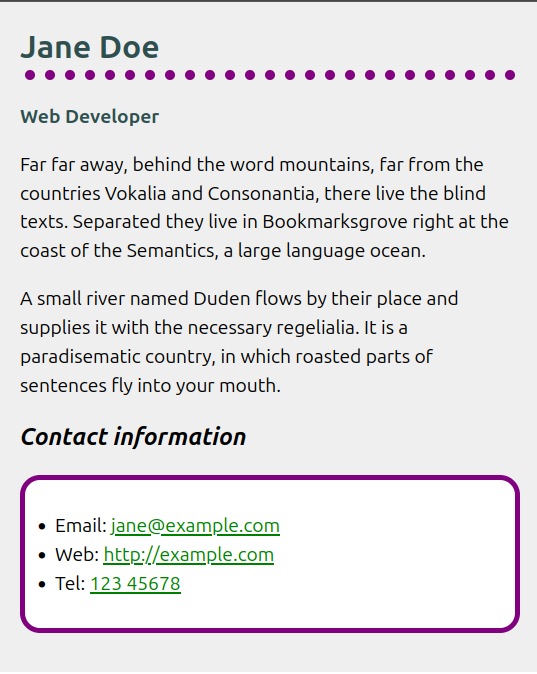

author: Tony Beaumont
summary: Using GIT to track my work
id: git-01
categories: version-control
environments: Web
status: Published
feedback link: mailto:a.j.beaumont@aston.ac.uk

# Using GIT: How to complete and submit tasks

## Introduction

We are going to use GIT to keep track of versions of our work and submit completed exercises as a **Pull Request**.

### What you should already know

You should have done the prep in the [Onboarding module, Sprint 1](https://programming.codeyourfuture.io/onboarding/sprints/1/prep/)

### What you'll learn

- **fork** a repository
- **clone** a repository
- **basic git commands** such as `git add`, `git commit`, `git push`

### What you'll need

You need a laptop with `git` installed ([Download Git](https://git-scm.com/downloads)). You will also need VS Code installed ([Download VS Code](https://code.visualstudio.com/download)).

### What you'll do

You will fork and clone a git repository. Then do some work to complete an exercise. Finally you will submit your work in a Pull Request.

## Project brief

Follow the instructions below to style the bio. Try looking up the CSS features you'll need in the [MDN CSS reference](https://developer.mozilla.org/en-US/docs/Web/CSS/Reference).

### Box styles

1. Give the `&lt;body&gt;` element a padding of `20px` on all sides and a width of `500px`.
1. Give the `&lt;body&gt;` element a background color of `#efefef` (a light-gray &lt;hex-color&gt; value).
1. Center the `&lt;body&gt;` element inside the viewport by setting top- and bottom-margins of `0`, and left- and right-margins of `auto`.
1. Give the `&lt;ul&gt;` used for the contact details a background color of white, and a `5px` solid purple border on all sides. Give the `&lt;ul&gt;` padding of `30px` on all sides to push the content away from the border.
1. Give the `&lt;ul&gt;` a border radius of `20px`.

### Text styles

1. Make the level one heading dark gray, using the CSS color keyword `darkslategray`, and give the heading a `10px` dotted bottom border, which uses the CSS color keyword `purple`.
1. Make the level two heading italic.
1. Give the level one heading a font size of `2rem` and the level two heading a font size of `1.5rem`.
   Select the `&lt;div&gt;` using a class selector, and give it a color of `darkslategray` and a `bold` font weight.
1. Make the links `green`.
1. Make the links `darkgreen` while hovered over with the mouse pointer or focused via the keyboard (you'll need to use a couple of pseudo-classes for this).
1. Make the links lose their underline while hovered or focused.

### Hints and tips

1. Use the [W3C CSS Validator](https://jigsaw.w3.org/css-validator/) to catch unintended mistakes in your CSS — mistakes you might have otherwise missed — so that you can fix them.
2. Try looking up some more advanced CSS features (again, the [MDN CSS reference](https://developer.mozilla.org/en-US/docs/Web/CSS/Reference) will be useful here) and add some more styles to your solution. Get adventurous!
3. Remember that there is no wrong answer here — at this stage in your learning you can afford to have a bit of fun.

### Example

Your finished example should end up looking something like this:

