author: Tony Beaumont
summary: Using GIT to track my work
id: git-01
categories: version-control
environments: Web
status: Published
feedback link: mailto:a.j.beaumont@aston.ac.uk

# Using GIT: How to complete and submit tasks

## Introduction

We are going to use GIT to keep track of versions of our work and submit completed exercises as a **Pull Request**.

### What you should already know

You should have done the prep in the [Onboarding module, Sprint 1](https://programming.codeyourfuture.io/onboarding/sprints/1/prep/)

### What you'll learn

- **fork** a repository
- **clone** a repository
- **basic git commands** such as `git add`, `git commit`, `git push`

### What you'll need

You need a laptop with `git` installed ([Download Git](https://git-scm.com/downloads)). You will also need VS Code installed ([Download VS Code](https://code.visualstudio.com/download)).

### What you'll do

You will fork and clone a git repository. Then do some work to complete an exercise. Finally you will submit your work in a Pull Request.

## What is a Git repository?

The [GitHub Docs](https://docs.github.com/en/repositories/creating-and-managing-repositories/about-repositories) says the following about repositories:

> aside positive
> A repository is the most basic element of GitHub. It's a place where you can store your code, your files, and each file's revision history. Repositories can have multiple collaborators and can be either public or private.

This is the repository we are going to use today: [https://github.com/beaumoaj/git_practice](https://github.com/beaumoaj/git_practice). When you follow the link, this is what you will see.

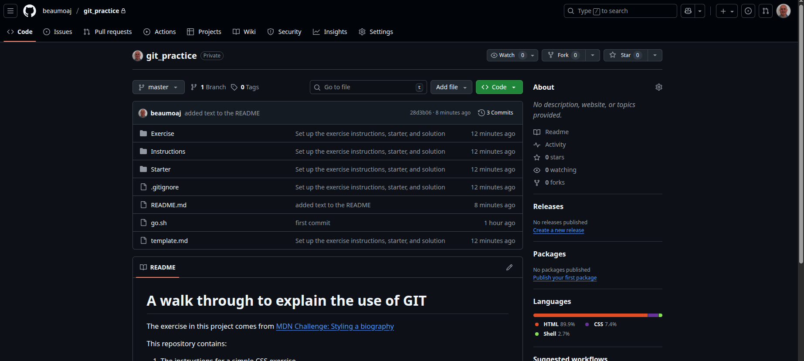

To work on a repository you need to create a copy of the whole repository down to your local computer This is referred to as creating a `clone` of the repository. However this repository does not belong to you and so if you `clone` it you will not be able to save your changes back to the repository. To allow your changes to be saved, you must first `fork` the repository to your own GitGub account.

To complete your CYF work, you will usually be starting from a [CYF repository](https://github.com/codeyourfuture). The usual process will be to:

1. `fork` the original repository so you have a copy of it in **your own GitHub account**.
2. `clone` your copy of the repository back to **your computer**. Once the files are on your computer, you can edit them.
3. Do some work in which you make changes to the files in the copy on your computer.
4. Inform `git` which files you have changed using the `git add` command.
5. Save a local snapshot of your updated files by using the `git commit` command.
6. Upload your changes to the copy of the repository in your GitHub account using the `git push` command.
7. Repeat steps 3 to 6 until you have finished met the success criteria for the work.
8. Submit your work by submitting a **pull request**. A pull request will notify the owner of the **original repository** (which you forked) that you are sending them some changes to look at. CYF uses pull requests to keep track of work submitted by trainees. Volunteers will look at your pull requests and either approve (ie. you completed it correctly) or reject them (ie. you didn't meet the success criteria).

> aside positive
>
> # Terminology
>
> **fork** copy a repository from some else's GitGub account to your own GitHub account.<br/>
>
> **clone** copy a repository down to your own computer.

Now we will step through the process and see who it works.

## Forking a repository

> aside positive
> Forking a repository means take an original repository from someone else's github account and make a new copy in your own github account.

Open the repository [https://github.com/beaumoaj/git_practice](https://github.com/beaumoaj/git_practice) in your web browser.

Click on the **Fork** button and choose **Create new fork** as shown on the right hand side of this image:
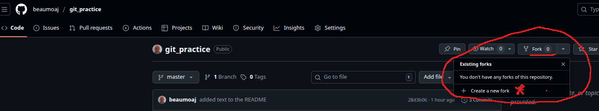

You will be shown the following form:
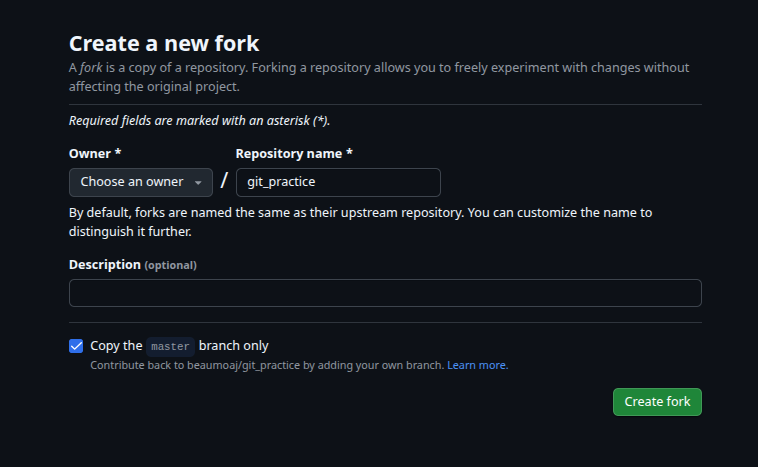

1. You should ensure that the **Owner** field is set to your username.<br/>
1. You can keep the suggested **Repository name** which will be used as the name of the repository in your github account.<br/>
1. The **Description** field may already contain some suitable text, but if not you could write your own or edit the original. For example, you could write:
   ```console
   This repository is part of Onboarding sprint 1
   ```
1. Finally, click the **Create fork** button.

When Github has finished making a copy of the repository, you will be shown the new copy in your account. You can tell the difference between the two repositories by checking the URL in the address bar of your browser. For example, if the URL https://**github.com**/**CodeYourFuture**/**js-exercises** (reading from right to left) tells me that this is a repository called **js-exercises** owned by a user called **CodeYourFuture** on **github.com**. If I fork it to my account, the new copy will have the URL https://github.com/**beaumoaj**/js-exercises. The difference is that the owner is now **beaumoaj**, which is my github user name. When you fork a repository, you should always check that you are working with **your** copy.

## Cloning a repository

> aside positive
> Cloning a repository means to select a github repository (usually) in your account and copy all the files down to your local computer.

First, you need to have a **directory** (another name for **folder**) into which you can copy the repository. To keep track of all of your work for ITP, create a new **directory** called (for example) `CYF-ITP`. **Inside** that directory, create new sub-directory for each sprint. Your sub-directory could be called (for example) `Onboarding-Sprint1`.

Now open the new folder in a terminal window. In a Linux computer press the **Ctrl** and **ALT** keys together (I will write this as `CTRL-ALT`) and then press the `t` key and a new terminal will open in your home folder. Now you need to change into your new directory using the `cd` command (you can remember `cd` as standing for Change Directory).

```bash
cd ~/CYF-ITP/Onboarding-Sprint1
```

Here is an example from my computer:
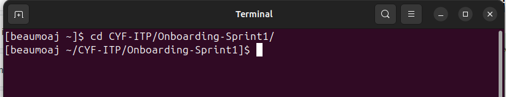

Notice that the prompt to the left of the cursor will tell you which is the current directory.

You can use the `ls` command to LiSt the files in the current directory. If you do that in your new directory you won't see any files. It should look like this:
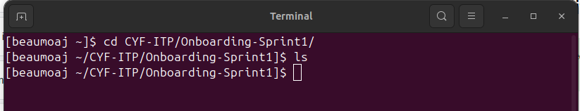

Now lets `clone` the repository.

If it is not already open, open your copy of the repository on GitHub in your web browser. Make sure you are starting from **your copy of the repository** (look for **your username** in the URL in your web browser). Click the green **Code** button and you will see the **Clone** options.

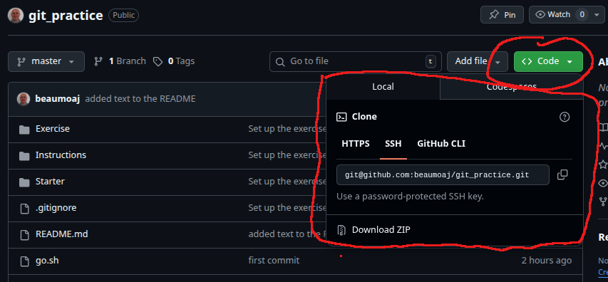

You need to select either **HTTPS**, or **SSH**, or **GitHub CLI** and the copy the URL from the box.

> aside positive
>
> To use the **SSH** option, you must have set up `SSH` access (see [https://docs.github.com/en/authentication/connecting-to-github-with-ssh](https://docs.github.com/en/authentication/connecting-to-github-with-ssh)) before you can use that way of cloning a repository.
>
> To use the **GitHub CLI** you need to install the GitHub Command Line tools on your computer (see [https://cli.github.com/](https://cli.github.com/))

We will use the **HTTPS** option. Select the `HTTPS` tab and copy the URL from the box. Now go to you terminal window and use the `git clone` command to clone the repository. The command is a version of the command shown below but the text **YOUR_USERNAME** should be replaced with whatever your username is on GitHub (you can anyway paste the URL after copying it from you repository)

```console
git clone https://github.com/YOUR_USERNAME/git_practice.git
```

When you enter your version of the above command, you will get some messages printed to your terminal as the repository is copied down to your computer. If you use the `ls` command again, you should now see a new folder with the same name as the repository. On my computer it looks like this. The new folder is called `git_practice`:
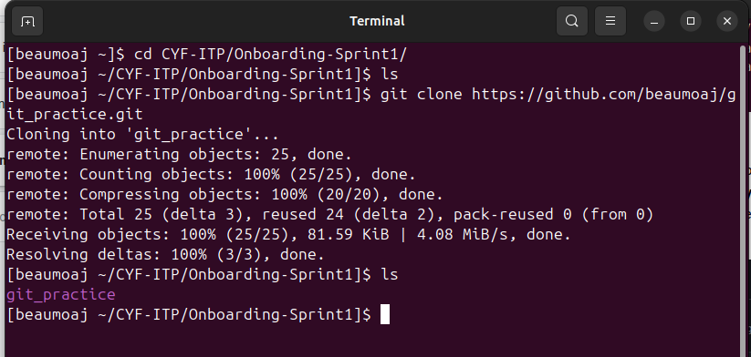

Now open your new git project in VS Code. The quickest way to do that is via the same terminal window you used above and type the following two commands:

```console
cd git_practice
code .
```

VS code should open displaying the new repository. It looks like this on my computer:

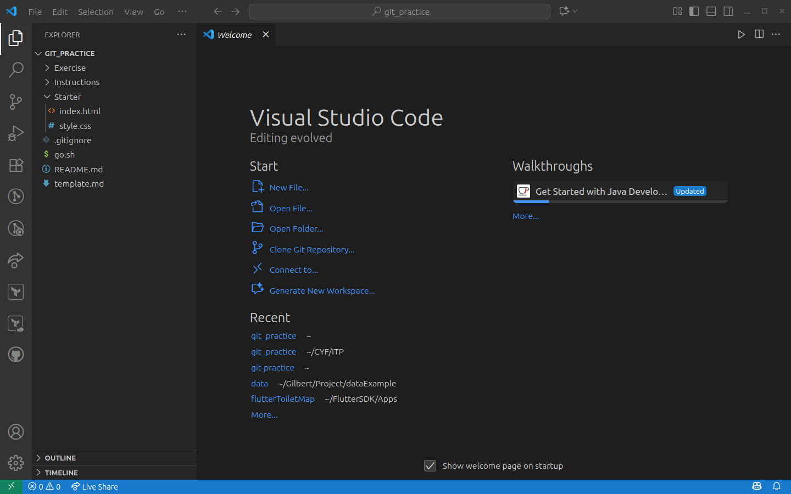

## Do some work and use Git

We will now work in VS code. If you opened the repository directory in VS Code, expand the `Starter` directory and open the `index.html` file from that directory. It looks like this in my computer:
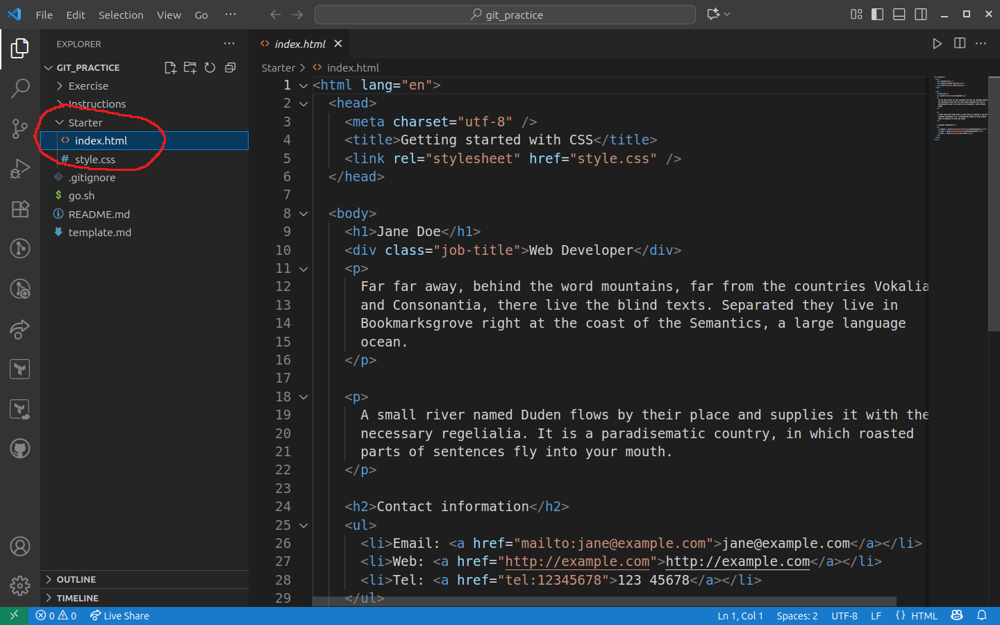.

From the VS Code menu bar, select **Terminal** and then **New Terminal** and a new terminal window will appear inside VS Code below the HTML file. This terminal is just like the other terminal window you used in the previous step. You can type `ls` in the terminal window and you should see the same list of files and directories as you see in the **Explorer** panel. Here it is in my computer:

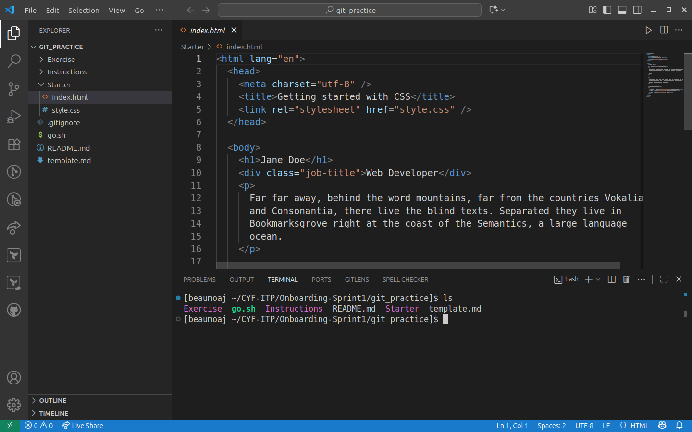

We will use this terminal window to run Git commands as we work.

### The `git status` command

Before we do anything we will look at the `git status` command. In your terminal window type:

```console
git status
```

You should see a response something like this:

```console
[beaumoaj ~/CYF-ITP/Onboarding-Sprint1/git_practice]$ git status
On branch master
Your branch is up-to-date with 'origin/master'.

nothing to commit, working tree clean
[beaumoaj ~/CYF-ITP/Onboarding-Sprint1/git_practice]$
```

This is telling us we are working on a **branch** called `master`. This is a the master copy of the project.
It also tells us "nothing to commit, working tree clean". This means we haven't yet made any changes.

Now we will make a change and see the effect.

In your `index.html` look for the following line:

```html
<h1>Jane Doe</h1>
```

Edit the file to change the name from **Jane Doe** to your own name. When you have done that, rerun the `git status` command in the console window. You should see somethin glike the following text:

```console
[beaumoaj ~/CYF-ITP/Onboarding-Sprint1/git_practice]$ git status
On branch master
Your branch is up-to-date with 'origin/master'.

Changes not staged for commit:
  (use "git add <file>..." to update what will be committed)
  (use "git restore <file>..." to discard changes in working directory)
        modified:   Starter/index.html

no changes added to commit (use "git add" and/or "git commit -a")
[beaumoaj ~/CYF-ITP/Onboarding-Sprint1/git_practice]$
```

This tells us that there are changes to the files. Specifically, that we have modified `Starter/index.html`. It also tells us that no changes have been added to commit. It suggests we use `git add` to do that.

### The `git add` command

We have made a change to the file called `Starter/index.html` (this is the path to the file, `Starter` is the directory name and `index.html` is the name of the file that changed).

We need to stage the change (meaning we are informing git of the changes). In your terminal window type:

```console
git add Starter/index.html
```

You should not see any output after running that command. Now re-run the `git status` command. Here are the two commands in my terminal.

```console
[beaumoaj ~/CYF-ITP/Onboarding-Sprint1/git_practice]$ git add Starter/index.html
[beaumoaj ~/CYF-ITP/Onboarding-Sprint1/git_practice]$ git status
On branch master
Your branch is up-to-date with 'origin/master'.

Changes to be committed:
  (use "git restore --staged <file>..." to unstage)
        modified:   Starter/index.html

[beaumoaj ~/CYF-ITP/Onboarding-Sprint1/git_practice]$
```

The `git status` output tells us we now have changes to be committed and tells us which file has been modified.

### The `git commit` command

We can tell git to make a note of the current version of the project using the `git commit` command. We need to add a message to the commit to explain what changes have been made in this version. Our message in this case should say we changed the name in the heading to be our own name. Here is the command:

```console
git commit -m "Changed the name in the header to be my name"
```

The `-m` in the command above means "and the message is..." and we follow the `-m` with a space and then the message in double-quotes. Here is the output in my computer:

```console
[beaumoaj ~/CYF-ITP/Onboarding-Sprint1/git_practice]$ git commit -m "Changed the name in the header to be my name"
[master 1a09007] Changed the name in the header to be my name
 1 file changed, 1 insertion(+), 1 deletion(-)
[beaumoaj ~/CYF-ITP/Onboarding-Sprint1/git_practice]$
```

The output is telling us that 1 file changed, we inserted some text (our name) and we deleted some text (Jane Doe's name).

### The `git push` command

After we have committed our change to the title of the web page, we can once again issue the `git status` command. If you do that now you will see some output a like the following:

```console
[beaumoaj ~/git_practice]$ git status
On branch master
On branch master
Your branch is ahead of 'origin/master' by 1 commit.
  (use "git push" to publish your local commits)

nothing to commit, working tree clean
[beaumoaj ~/git_practice]$
```

It says we are on the `master` branch and that branch is ahead of the `origin/master` meaning the version on github.com by one commit (that is the commit we just did). In order to update the version on github.com we can use the `git push` command. This will push our changes back out to the version of the repository on GitHub.com. Type the command in your terminal now:

```console
[beaumoaj ~/git_practice]$ git push
Enumerating objects: 7, done.
Counting objects: 100% (7/7), done.
Delta compression using up to 8 threads
Compressing objects: 100% (4/4), done.
Writing objects: 100% (4/4), 405 bytes | 405.00 KiB/s, done.
Total 4 (delta 2), reused 0 (delta 0), pack-reused 0 (from 0)
To github.com:beaumoaj/git_practice.git
   71d4cd5..43eb47f  master -> master
[beaumoaj ~/git_practice]$
```

This tells us that `git` is packaging up the change we made and writing it back to github.com. The last two lines say it is sending it to `github.com:beaumoaj/git_practice.git` which is the original repository on github.com and the data being sent is from our local master branch back to the origin's master branch.

If you open your github.com repository in your web browser (or refresh the page if it is already open), navigate into the `Starter` folder and click on `index.html`, you will see that this version is now the same as you have on your computer. It contains your name in the header.

## Summary so far

So far you have done the following set of actions:

1.  **Forked** someone else's git repository to make a copy in your GitHub account.
1.  **Cloned** your copy of that repository down to your local computer
1.  Did some work on editing the files (in fact we only made one change, but that is enough for this example).
1.  **Added** our changes using the `git add` command
1.  **Made a snapshot** (a new version) of the repository using `git commit`
1.  **Pushed** the new version back to the source copy on GitHub using the `git push` command.

> aside positive
>
> Usually we will make more than one change before creating a new version with `git commit`. However there are no rules on this and we can `add` and `commit` as often as we like. We should `push` our work back to GitHub regularly.

### More tasks

To practice what we just did, here are some more tasks for you to do. Complete them all and then `add` the changes, `commit` them to make a new version and `push` that new version back to GitHub.

1.  Find the job title on the web page and change it to `CodeYourFuture Trainee`
1.  Find the email address and change it to your email address
1.  Find the Web link and change it to point to the ITP syllabus page which is [https://programming.codeyourfuture.io/](https://programming.codeyourfuture.io/). Check than the link goes to the right place when you click on it. If you have installed the **CYF extensions to VS Code**, you should be able to right click on the `index.html` in the `Starter` folder and choose `Open with Live Server` to see the web page.

> aside positive
>
> To install the CYF extension pack to VS code,
>
> - click on the Extansions icon on the left (its highlighted in the image below),
> - type `codeyourfuture` in the search bar,
> - select the extension and click `install`. Its already installed for me so I see options to `disable` or `uninstall` it.
>
> 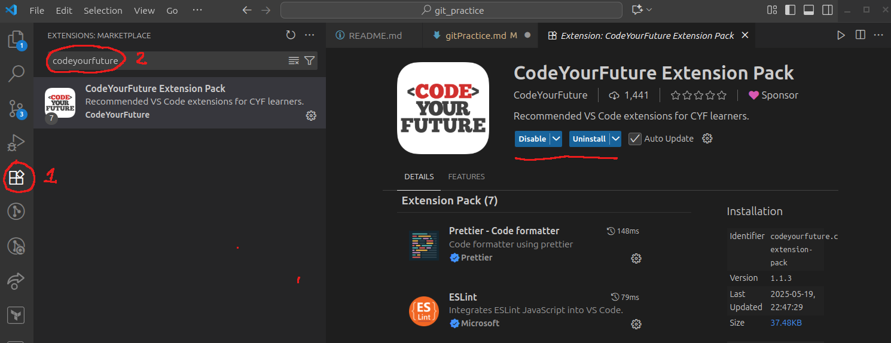

When you are sure you have done everything above, go on to the next page which gives you an exercise to add CSS styling to the web page. Be sure to `add`, `commit` and `push` your changes every time you complete one of the steps.

## Project brief

Follow the instructions below to style the bio. Try looking up the CSS features you'll need in the [MDN CSS reference](https://developer.mozilla.org/en-US/docs/Web/CSS/Reference).

### Box styles

1. Give the `&lt;body&gt;` element a padding of `20px` on all sides and a width of `500px`.
1. Give the `&lt;body&gt;` element a background color of `#efefef` (a light-gray &lt;hex-color&gt; value).
1. Center the `&lt;body&gt;` element inside the viewport by setting top- and bottom-margins of `0`, and left- and right-margins of `auto`.
1. Give the `&lt;ul&gt;` used for the contact details a background color of white, and a `5px` solid purple border on all sides. Give the `&lt;ul&gt;` padding of `30px` on all sides to push the content away from the border.
1. Give the `&lt;ul&gt;` a border radius of `20px`.

### Text styles

1. Make the level one heading dark gray, using the CSS color keyword `darkslategray`, and give the heading a `10px` dotted bottom border, which uses the CSS color keyword `purple`.
1. Make the level two heading italic.
1. Give the level one heading a font size of `2rem` and the level two heading a font size of `1.5rem`.
   Select the `&lt;div&gt;` using a class selector, and give it a color of `darkslategray` and a `bold` font weight.
1. Make the links `green`.
1. Make the links `darkgreen` while hovered over with the mouse pointer or focused via the keyboard (you'll need to use a couple of pseudo-classes for this).
1. Make the links lose their underline while hovered or focused.

### Hints and tips

1. Use the [W3C CSS Validator](https://jigsaw.w3.org/css-validator/) to catch unintended mistakes in your CSS — mistakes you might have otherwise missed — so that you can fix them.
2. Try looking up some more advanced CSS features (again, the [MDN CSS reference](https://developer.mozilla.org/en-US/docs/Web/CSS/Reference) will be useful here) and add some more styles to your solution. Get adventurous!
3. Remember that there is no wrong answer here — at this stage in your learning you can afford to have a bit of fun.

### Example

Your finished example should end up looking something like this:


## Creating a pull request

Now we will look at how to submit your work back to the CodeYourFuture GitHub account for someone to review.

I have completed the project, here is a view of my web page displayed in the Live Server:
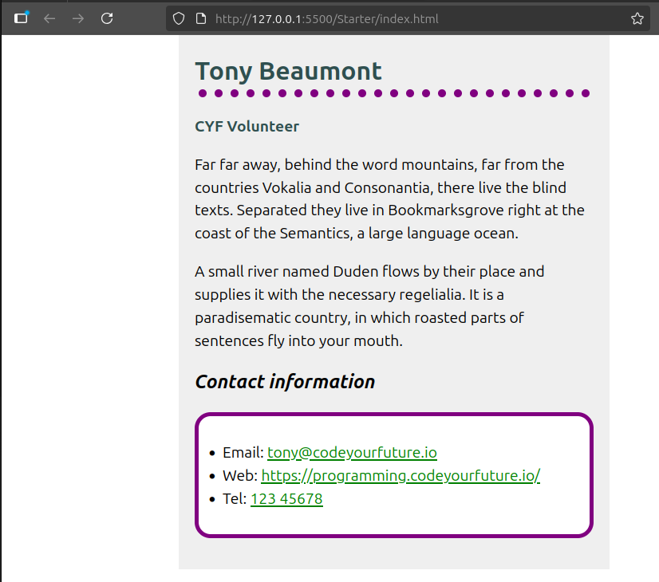

A pull request is a concept belonging to GitHub and is not part of git.

To start a new pull request first make sure you have run `git commit` and `git push` to ensure that the repository on your GitHub account is up to date with all of your changes. Then open your GitHub repository in your web browser (or reload the page if it is already open to ensure you are seeing the most recent version).

Here is my version of the repository on GitHub:

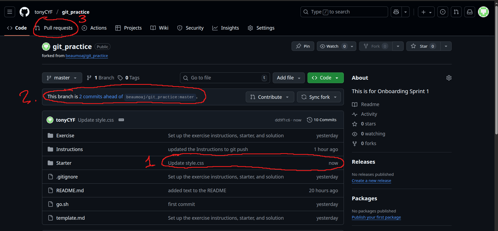

We can notice the following things:

1.  I just now comitted and pushed changes to style.css according to the message shown next to the `Starter` directory.
1.  My copy of the repository is 2 commits ahead of the original repository (the one I initially forked).
1.  I have completed the work so I can start a pull request by clicking on the `Pull requests` tab.

Click on your `Pull requests` tab and you should see the following screen.
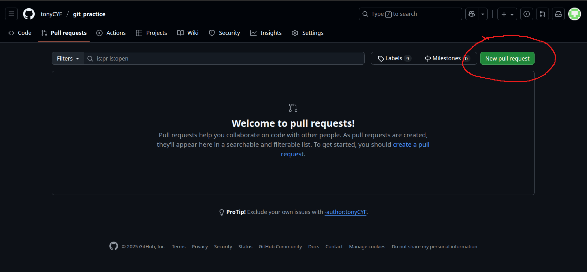

Click the `New pull request` button and you will see a screen comparing the changes between your version and the original version of the repository:
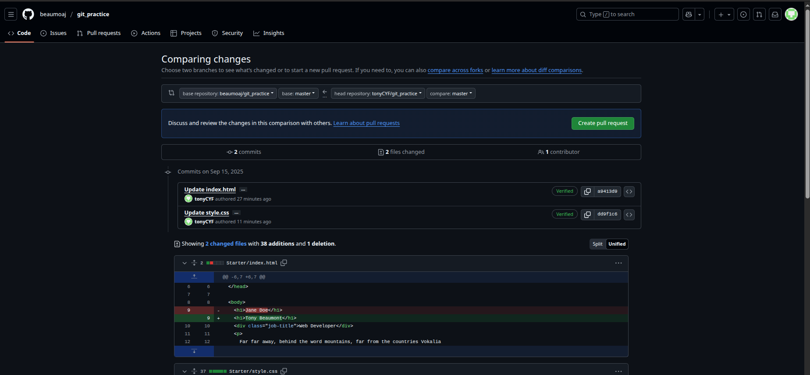

Have a look at those changes. If there are success criteria for the exercise, check one last time that you have met them all. Once you are happy, click the `Create pull request` button. You will be taken to the following form:

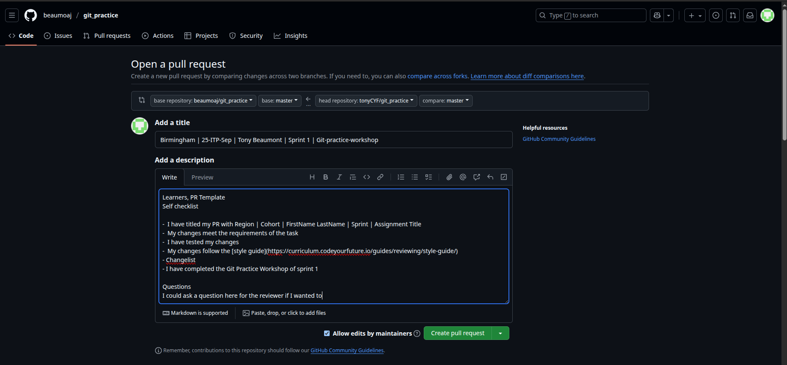

Most CYF exercises will have a template in the description, so I have copied the template into my description here. The `Title` of the pull request should follow the format:

```console
Region | Cohort | My Name | Sprint x | Task name
```

The template for a pull request has a number of things for you to complete. You get one more chance to check everything before you submit. Here is a sample description following the usual template:

```console
Learners, PR Template

Self checklist

-  I have titled my PR with Region | Cohort | FirstName LastName | Sprint | Assignment Title
-  My changes meet the requirements of the task
-  I have tested my changes
-  My changes follow the [style guide](https://curriculum.codeyourfuture.io/guides/reviewing/style-guide/)

Changelist

- I have completed the Git Practice Workshop of sprint 1

Questions

I could ask a question here for the reviewer if I wanted to
```

If everything is good, click the green `Create pull request` button. You will see the pull request appear on the original repository:


If this was a proper exercise to be submitted, a volunteer would look at your pull request, they would check the changes to the files that you submitted and then give you some feedback.

## Summary

We have seen

- how to fork and clone repositories
- how to add and commit changes
- how to push new versions back to GitHub
- how to create a new pull request to submit some work.

### What we haven't covered:

- Git branches. There was an exercise on branching in the prep for Sprint 1: [https://programming.codeyourfuture.io/onboarding/sprints/1/prep/#branching](https://programming.codeyourfuture.io/onboarding/sprints/1/prep/#branching). If you didn't do that before, go and complete it now. Branches allow us to do some development on a particular part of the project (for example, one exercise in the backlog). You will almost always need to create a new branch for each exercise you complete and the pull request should be created for that branch.

* Git in VS code. Code has a user interface for git built into it. If you don't like using the terminal to enter commands, you can use the interface in VS Code. Here is the version control panel open in my version of VS Code:
  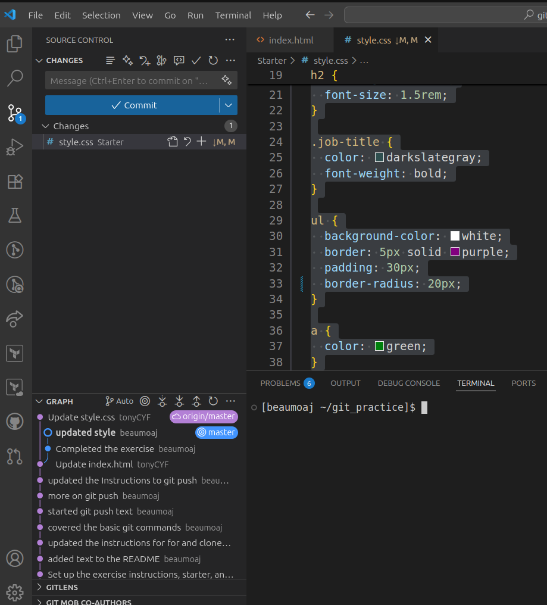
  I would advise you to look at the documentation for source control in VS Code if you plan to use that interface. You can find that here: [https://code.visualstudio.com/docs/sourcecontrol/overview](https://code.visualstudio.com/docs/sourcecontrol/overview)

### Further reading

You can find more information and examples in the GitPro book which you will find here: [https://git-scm.com/book/en/v2](https://git-scm.com/book/en/v2)

There is a playlist called "GitHub for Beginners" on YouTube: [https://www.youtube.com/playlist?list=PL0lo9MOBetEFcp4SCWinBdpml9B2U25-f](https://www.youtube.com/playlist?list=PL0lo9MOBetEFcp4SCWinBdpml9B2U25-f)
